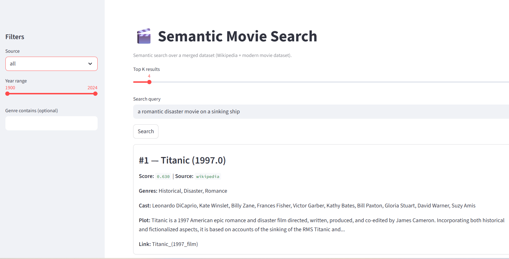
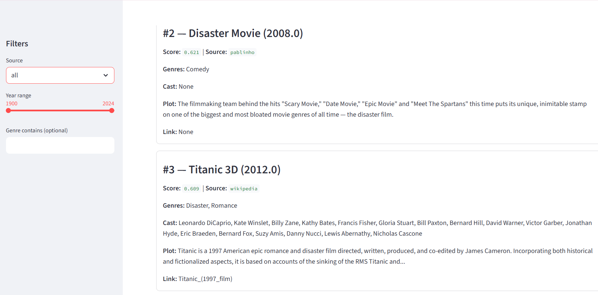

# 🎬 Semantic Movie Search Engine

A transformer-based **Semantic Search Engine** built with:

- 🧠 Sentence-BERT (MiniLM)
- ⚡ FAISS (Vector Search)
- 🌐 Streamlit (Interactive UI)

This system retrieves movies based on **meaning**, not keyword matching.

Instead of matching exact words, it understands concepts using embeddings and returns the most semantically similar results.

---

# 🚀 Project Overview

This project demonstrates how to build a full semantic retrieval pipeline:

1. Collect movie datasets  
2. Clean and structure text  
3. Generate embeddings using Sentence-Transformers  
4. Store vectors in FAISS  
5. Build a semantic search function  
6. Create an interactive web interface  

Final indexed size:

**46,000+ movies**  
(Merged Wikipedia + Modern Movie Dataset)

---

# 🧠 How It Works

### Step 1 — Text Structuring

Each movie is transformed into a rich semantic field:

Title: <title> | Plot: <overview> | Genres: <genres> | Cast: <cast>

This improves contextual understanding.

---

### Step 2 — Embedding Generation

Model used:
sentence-transformers/all-MiniLM-L6-v2

Each movie becomes a:

- 384-dimensional vector
- L2-normalized for cosine similarity

---

### Step 3 — Vector Indexing

Embeddings are stored in a **FAISS index** for fast nearest-neighbor search.

Without FAISS:
- Search would require scanning 46,000 vectors manually.

With FAISS:
- Search takes milliseconds.

---

### Step 4 — Query Flow

When a user enters a query:

1. Query → embedding  
2. FAISS computes similarity against all movie vectors  
3. Top-K most similar movies returned  
4. Metadata displayed in web app  

---

# 📂 Project Structure
semantic-search-engine/
│
├── data/
│ ├── raw/
│ └── processed/
│
├── src/
│ ├── ingest.py
│ ├── preprocess.py
│ ├── embed.py
│ ├── index_faiss.py
│ ├── search.py
│ └── merge_datasets.py
│
├── utils/
│
├── outputs/
│ ├── embeddings/
│ └── indexes/
│
├── web_app/
│ └── app.py
│
└── requirements.txt

---

# ⚙️ Installation

Clone the repository:

cd semantic-search-engine-transformers

Create a virtual environment:
python -m venv .venv
..venv\Scripts\activate

Install dependencies: pip install -r requirements.txt

---

# 🏗 Generate Embeddings & Index

Run:
python -m src.embed
python -m src.index_faiss

This will:
- Generate embeddings
- Save them
- Build the FAISS index

---

# 🌐 Run Web Application
streamlit run web_app/app.py

Then open:http://localhost:8501

---

# 🔎 Example Semantic Queries

- a romantic disaster movie on a sinking ship  
- a young wizard attending a magical school  
- astronauts traveling through a wormhole to save humanity  
- a mafia family dealing with betrayal and crime  
- a team of superheroes fighting an alien invasion  

---

# 📈 Technologies Used

- Python
- Sentence Transformers
- FAISS
- Pandas
- NumPy
- Streamlit
- Hugging Face Datasets

---

# 🎯 What This Project Demonstrates

- Transformer-based semantic retrieval  
- Vector similarity search at scale  
- Multi-source dataset integration  
- Modular ML project architecture  
- Production-ready pipeline design  

This project moves beyond keyword search into true **semantic understanding**.

---
 
 

# 👤 Author

Built as an advanced NLP portfolio project demonstrating semantic search architecture.

